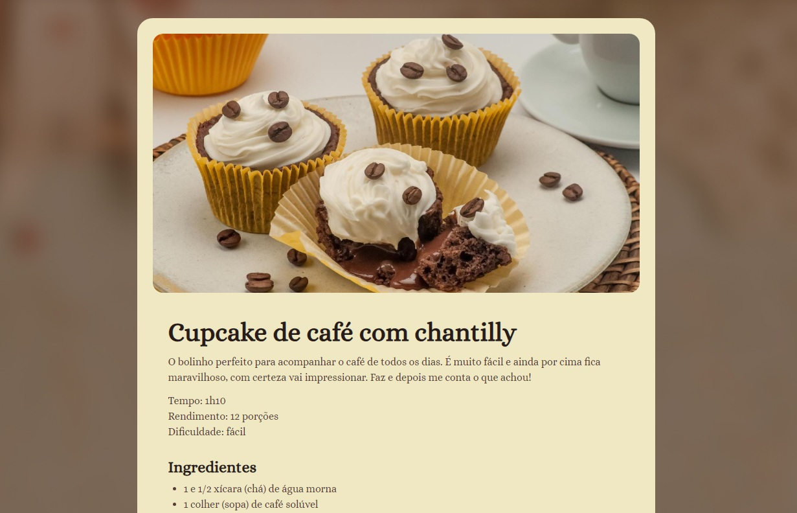

<h1 align="center"> Página de receitas </h1>

Projeto desenvolvido a partir do curso Fullstack da <a href="https://www.rocketseat.com.br/" target="_blank">Rocketseat</a> 

  <a href="#-tecnologias">Tecnologias</a>&nbsp;&nbsp;&nbsp;|&nbsp;&nbsp;&nbsp;
  <a href="#-projeto">Projeto</a>&nbsp;&nbsp;&nbsp;|&nbsp;&nbsp;&nbsp;
  <a href="#-layout">Layout</a>&nbsp;&nbsp;&nbsp;|&nbsp;&nbsp;&nbsp;
  <a href="#memo-licença">Licença</a>

  

 

  

  <a href="https://lgjor.github.io/recipepage/" target="_blank">Preview</a>

## 🚀 Tecnologias

Esse projeto foi desenvolvido com as seguintes tecnologias:

- HTML e CSS
- Flexbox
- Git e Github
- Figma

## 💻 Projeto

O Technews é um portal de notícias.

## 🔖 Layout

Você pode visualizar o layout do projeto através [Desse link](https://www.figma.com/community/file/1360315130061454535). É necessário ter conta no [Figma](https://figma.com) para acessá-lo.

## :memo: Licença

Esse projeto está sob a licença MIT.

---

♥
